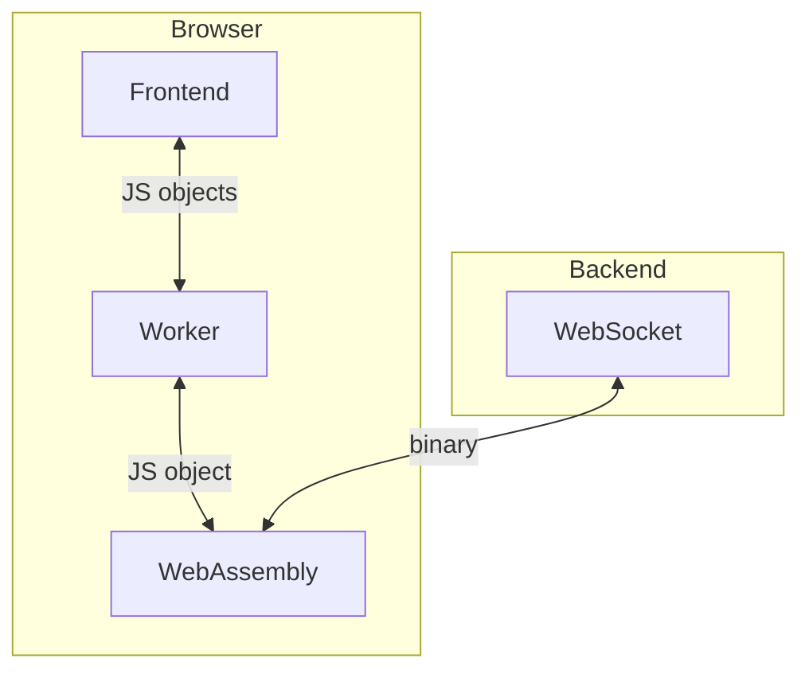

# Architecture

## Javascript implementation

For Javascript the same Go library code is used as WebAssembly. There is a 'thin' javascript wrapper around this that exposes a public API. This abstracts away the implementation details of the underlying protocol. So changes on the Go side often won't need changes in the javascript clients.

